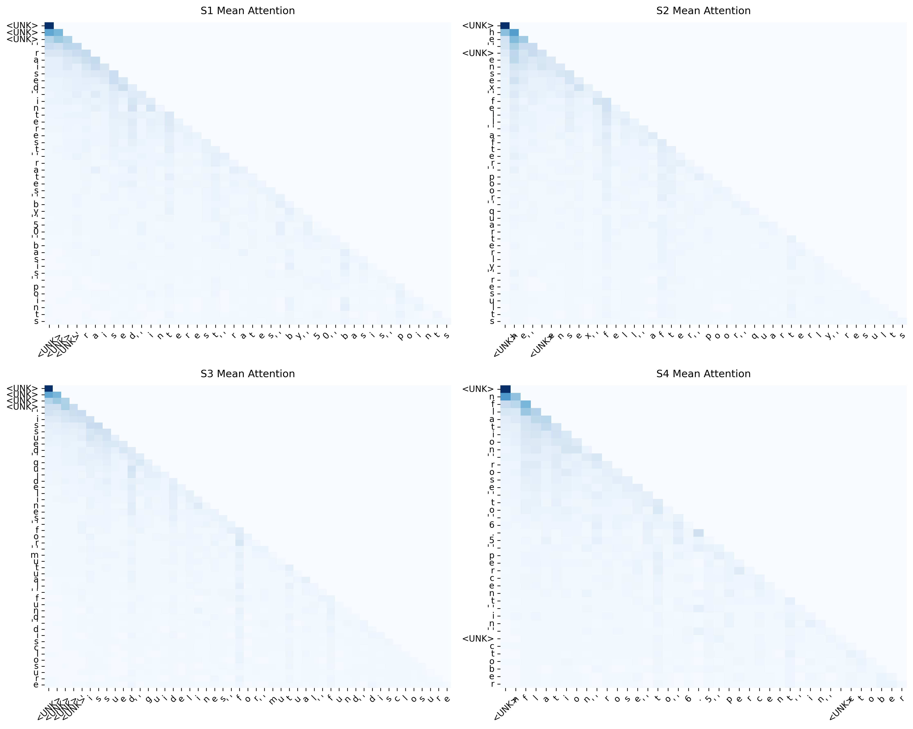

# FinGPT-Mini 📉🧠

<p align="center">
  
  
  
</p>

FinGPT-Mini is a custom-built, highly optimized generative language model trained entirely from scratch on Indian financial text (including news, RBI circulars, SEBI guidelines, and financial reports). 

Built completely in PyTorch, it features a complete end-to-end pipeline—from raw PDF data extraction all the way to an interactive autoregressive generation engine. Designed as a "Mini" model, it consists of an ultra-efficient **~800K-parameter** GPT-style transformer architecture capable of rapid training on consumer hardware while still learning complex financial semantics.

## 🚀 Key Features

- **End-to-End Pipeline**: Includes a complete data extraction engine that parses unformatted raw PDFs and CSVs into a cleaned, tokenizable corpus.
- **Custom Transformer Architecture**: Implements a Pre-Norm Transformer with 4 layers, 4 attention heads, and GELU activations.
- **Causal Self-Attention**: Hand-written multi-head causal self-attention mechanism, featuring upper-triangular look-ahead masking to prevent future-token-peeking.
- **Weight Tying**: Ties the token embedding matrix with the final `lm_head` projection layer, reducing the total parameter count by ~20% and improving regularization.
- **Custom Tokenization & Dataloaders**: Features a custom character-level tokenizer and sliding-window dataloaders mapped to the exact context length of the model.
- **Interpretability Hooks**: Uses PyTorch `register_forward_hook` to extract hidden attention matrices from the multi-head attention blocks, allowing for visual analysis of semantic learned structures.

## 📈 Model Performance & Metrics
When trained on an NVIDIA T4 Cloud GPU, the training loop is optimized to maximize memory bandwidth, achieving incredible throughput. 

* **Training Speed:** > 10.8 Million tokens per second
* **Validation Loss:** 1.04
* **Validation Perplexity:** 2.84

*(Note: A validation perplexity of 2.84 indicates the model is highly confident and has effectively mapped the syntax and terminology of the financial domain).*

## 📊 Interpretability & Attention Visualizations

One of the standout features of this repository is the ability to visualize the model's internal attention mechanisms to ensure it is actually learning financial syntax rather than just memorizing sequences. 

The heatmaps below show the global mean attention across all layers and heads for financial sentences. You can see how the model correctly learns to prevent future-token-peeking (the blank upper triangle) while forming strong localized diagonal patterns to predict the next word, supplemented by long-range vertical stripes (e.g., verbs attending back to subjects).

*(See `notebooks/visualization.ipynb` for full layer-by-layer breakdowns)*



## 💻 Usage

### 1. Data Preparation
To extract and clean raw PDFs and CSVs into the training corpus:
```bash
python src/data_cleaner.py
```

### 2. Training the Model
To train the model on the financial corpus using the character-level tokenizer:
```bash
python src/train.py \
    --corpus data/cleaned_corpus.txt \
    --char-vocab data/char_vocab.json \
    --output-dir checkpoints \
    --epochs 10 \
    --batch-size 1024
```
*Tip: On Google Colab, you can achieve ultra-fast training by adjusting the `dataset.py` sliding window stride to match your context length.*

### 3. Interactive Text Generation (Demo)
Once trained, you can interact with the brain of your model via an interactive prompt loop that utilizes temperature and Top-k sampling:
```bash
python demo.py
```
*Example Prompt: "The Reserve Bank of India"*

### 4. Visualizing Attention
To extract the attention weights and generate heatmaps from your trained checkpoint:
```bash
python src/visualize_attention.py
```

## 🛠️ Project Structure
- `src/model.py`: Core GPT Transformer architecture implementation
- `src/attention.py`: Causal Self-Attention block
- `src/tokenizer.py`: Tokenizer logic
- `src/dataset.py`: PyTorch Dataloader and sliding window logic
- `src/data_cleaner.py`: Pipeline for converting PDFs/CSVs to a clean text corpus
- `src/train.py`: Main training loop with Cross-Entropy validation tracking
- `src/generate.py`: Core autoregressive generation and sampling functions
- `src/visualize_attention.py`: Forward hooks and Seaborn heatmap generation
- `demo.py`: Interactive CLI tool for talking to the trained model
